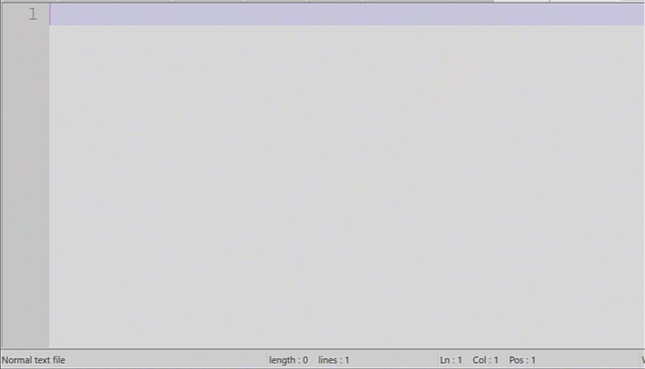

# EXAMPLES

This folder contains examples of usage.

## Example 1

By executing this command:

    python file2npp_macro.py testinput.txt testoutput.xml mytestmacro f5 --ctrl

this script:
* parses the ```testinput.txt``` file.

    This is the file content:
    ```
    this

    is

    # A

    test
    ```
* outputs the macro inside the ```testoutput.xml``` file

    This is the output file content:
    ```
    <Macros>
        <Macro name="mytestmacro" Ctrl="yes" Alt="no" Shift="no" Key="116">
            <Action message="2170" wParam="0" lParam="0" sParam="t" type="1"/>
            <Action message="2170" wParam="0" lParam="0" sParam="h" type="1"/>
            <Action message="2170" wParam="0" lParam="0" sParam="i" type="1"/>
            <Action message="2170" wParam="0" lParam="0" sParam="s" type="1"/>
            <Action message="2170" wParam="0" lParam="0" sParam="&#x000D;" type="1"/>
            <Action message="2170" wParam="0" lParam="0" sParam="&#x000A;" type="1"/>
            <Action message="2170" wParam="0" lParam="0" sParam="&#x000D;" type="1"/>
            <Action message="2170" wParam="0" lParam="0" sParam="&#x000A;" type="1"/>
            <Action message="2170" wParam="0" lParam="0" sParam=" " type="1"/>
            <Action message="2170" wParam="0" lParam="0" sParam="i" type="1"/>
            <Action message="2170" wParam="0" lParam="0" sParam="s" type="1"/>
            <Action message="2170" wParam="0" lParam="0" sParam="&#x000D;" type="1"/>
            <Action message="2170" wParam="0" lParam="0" sParam="&#x000A;" type="1"/>
            <Action message="2170" wParam="0" lParam="0" sParam="&#x000D;" type="1"/>
            <Action message="2170" wParam="0" lParam="0" sParam="&#x000A;" type="1"/>
            <Action message="2170" wParam="0" lParam="0" sParam=" " type="1"/>
            <Action message="2170" wParam="0" lParam="0" sParam=" " type="1"/>
            <Action message="2170" wParam="0" lParam="0" sParam="#" type="1"/>
            <Action message="2170" wParam="0" lParam="0" sParam=" " type="1"/>
            <Action message="2170" wParam="0" lParam="0" sParam="A" type="1"/>
            <Action message="2170" wParam="0" lParam="0" sParam="&#x000D;" type="1"/>
            <Action message="2170" wParam="0" lParam="0" sParam="&#x000A;" type="1"/>
            <Action message="2170" wParam="0" lParam="0" sParam="&#x000D;" type="1"/>
            <Action message="2170" wParam="0" lParam="0" sParam="&#x000A;" type="1"/>
            <Action message="2170" wParam="0" lParam="0" sParam="t" type="1"/>
            <Action message="2170" wParam="0" lParam="0" sParam="e" type="1"/>
            <Action message="2170" wParam="0" lParam="0" sParam="s" type="1"/>
            <Action message="2170" wParam="0" lParam="0" sParam="t" type="1"/>
        </Macro>
    </Macros>
    ```
* the macro is called ```mytestmacro``` inside notepad++
* the macro is executed with this hotkey: ```Ctrl + f5```

If you place the ```<Macro></Macro>``` element inside the ```<Macros></Macros>``` element of the ```%appdata%\Notepad++\shortcuts.xml``` file you can execute this macro by pressing ```Ctrl + f5```:

> ATTENTION: If you have notepad++ open: close it and re-open it to confirm the changes.

> ATTENTION: Create a simple macro first from notepad++ and try to save it to check
> which hotkeys are not used already.

> ATTENTION: Don't replace all the ```%appdata%\Notepad++\shortcuts.xml``` file content: you just
> need to add the ```<Macro></Macro>``` element inside the ```<Macros></Macros>``` element.
>
> Keep everything else how it is: you risk to remove your old macros!

<center>



</center>